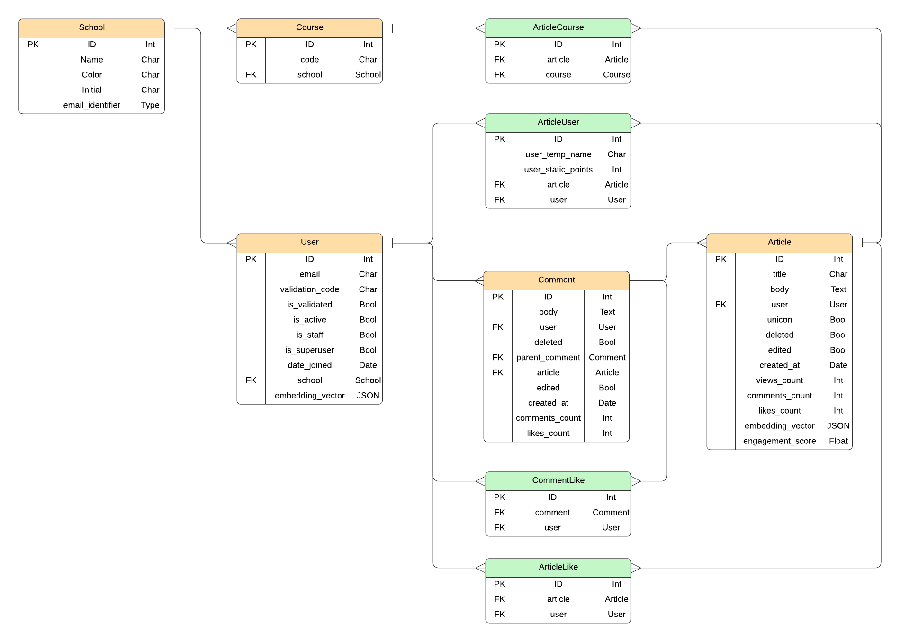
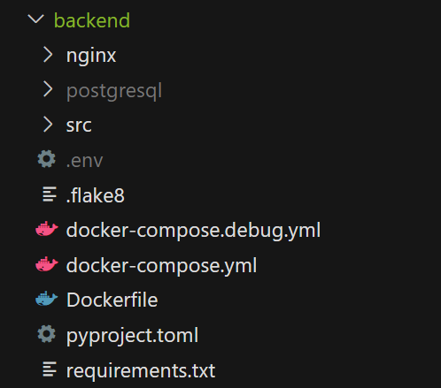

# UNI.CON

# Project Demo


### 🔗[Link to Website](https://unicon.min1870.com/)
### 📖[Link to report](https://helpful-shield-d0f.notion.site/UNI-CON-34c8c2c217184b2393035b9de94846e6?pvs=4)

### Contributors:

- **Minseok Kim** (Developer) - [200134kms@gmail.com](mailto:200134kms@gmail.com)
- **Heeeon Park** (Designer) - [s3938106@rmit.edu.vn](mailto:s3938106@rmit.edu.vn)
- **Hyuksang Lim** (Developer) - [ymyhssang.krn@gmail.com](mailto:ymyhssang.krn@gmail.com)

# **Problem Statement**

UNI.CON is a social networking platform that connects students and schools with each other. Powered by Django and FAISS, we have implemented an innovative algorithm that adapts to each student's interests and provides an ideal space for sharing thoughts. We include an anonymous posting system to encourage open expression. Furthermore, our unique UNI.CON feature also allows users to share articles across different universities.

# Tech Stack

- **Cloud Infrastructure**
    - **EC2 Instance**
        - Hosting the Web Server, Frontend, Backend.
- **Web Server**
    - **Nginx**
        - Reverse Proxying between clients and backend servers.
        - Encrypting and decrypting traffic using HTTPS.
- **Frontend**
    - **HTML & CSS & JavaScript (Powered by React & Vite)**
        - Markup and Styling for web page.
- **Backend**
    - **Django**
        - Building the API logic for the server.
    - **FAISS**
        - Handle embedding search.
    - **Open AI**
        - Generate embedding vectors of the content.
    - **Redis**
        - Storing the frequent access data
    - **SQLite**
        - Storing static data.

# ERD
We designed the database to satisfy all of the **1NF**, **2NF**, **3NF**, and **BCNF**, except for a few special attributes. 

Definitely, the `embedding_vector` stores multiple values into a single column in violation of **1NF**, but this decision was made to optimize vector similarity search performance using **FAISS**.

The `likes_count` and `comment_count` may seem redundant since they can be calculated by counting the data. However, we chose to include these attributes because they contain frequently accessed data and their potential inaccuracy does not significantly impact the user experience. We would choose not to store them if the structure is simple and the traffic to the attributes are not significant, but based on the traditional cases from other SNS platform, it seems reasonable exception to avoid the **Justin Bieber Problem**.


# Implementation Instructions

<aside>

**⚠️These are the instructions for running the server in debug mode.**

</aside>

**Prerequisites**:

- docker
- docker-compose
- node.js
- Necessary files
    - `.env`
    - `postgresql/`

### 0. Place the necessary files

The `.env` file contains secrets and configuration settings for debug mode that need to be modified later. The `postgresql/` directory contains **PostgreSQL** data, including table structures and values.

- .env → `UNI.CON/backend/`
- postgresql/ → `UNI.CON/backend/`



### 1. Change to Debug mode

After placing the necessary files in the `UNI.CON/backend/` directory, change the `DEBUG` setting from `False` to `True` in the `.env` file.

```docker
DEBUG = True
OPE... and more
```

Navigate to `UNI.CON/frontend/src/constants.jsx` and change the `DEBUG` value from `false` to `true` as shown below

```jsx
const DEBUG = true

let dom... and more
```

### 2. Set up frontend

Navigate to the `UNI.CON/frontend/` directory, install all necessary packages using `npm install`, and run `npm run dev` to start the frontend server.

### 3. Set up Backend

Navigate to the `UNI.CON/backend/` directory, then build the image and run the container using the `docker-compose.debug.yml` file by running: `docker compose -f docker-compose.debug.yml up`.

### DONE!

# API Document

## Account App

### `POST` `account/user/login/`

### REQUEST

- **Headers:** `"Content-Type":"application/json"`
- **Body:**

```json
{
    "email":"example@schoolemail.edu",
    "password":"strong_password",
}
```

### **RESPONSE**

```python
{
    "user": 3,
    "refresh": "eyJhbGciOiJIUz...FKdHLfko",
    "access": "eyJhbGciOiJIUzI...QluoCC0Y"
}
```

| Condition | Status | Progress |
| --- | --- | --- |
| Correct request | 202 Accepted | **TESTED**✅ |
| Incorrect email or password | 401 Unauthorized | **TESTED**✅ |

### `POST` `account/user/`

### REQUEST

- **Headers:** `"Content-Type":"application/json"`
- **Body:**

```json
{
    "email":"example@schoolemail.edu",
    "password":"strong_password",
}
```

### **RESPONSE**

```python
{
    "user": 3,
    "refresh": "eyJhbGciOiJIUz...FKdHLfko",
    "access": "eyJhbGciOiJIUzI...QluoCC0Y"
}
```

| Condition | Status | Progress |
| --- | --- | --- |
| Correct request | 201 Created | **TESTED**✅ |
| Invalid  | 400 Bad Request | **TESTED**✅ |
| Invalid email | 400 Bad Request | **TESTED**✅ |

### `POST` `account/user/validate/`

### REQUEST

- **Headers:** `"Content-Type":"application/json", "Authorization":"Bearer **ACCESS_TOKEN**"`
- **Body:**

```json
{
    "validation_code":"19239",
}
```

### **RESPONSE**

```python
{
    "detail": "Validation success"
}
```

| Condition | Status | Progress |
| --- | --- | --- |
| Correct request | 202 Accepted | **TESTED**✅ |
| Incorrect token | 401 Unauthorized | **TESTED**✅ |
| Incorrect validation code | 401 Unauthorized | **TESTED**✅ |

### `POST` `account/token/refresh`

### REQUEST

- **Headers:** `"Content-Type":"application/json", "Authorization":"Bearer **ACCESS_TOKEN**"`
- **Body:**

```json
{
    "refresh": "eyJhbGciOiJIUz...FKdHLfko"
}
```

### **RESPONSE**

```json
{
    "access": "eyJhbGciOiJIUzI...QluoCC0Y"
}
```

| Condition | Status | Progress |
| --- | --- | --- |
| Correct request | 200 OK | **TESTED**✅ |
| Incorrect token | 401 Unauthorized | **TESTED**✅ |
| Incorrect refresh token | 401 Unauthorized | **TESTED**✅ |

## Community App

### `POST` `community/article/`

### REQUEST

- **Headers:** `"Content-Type":"application/json", "Authorization":"Bearer **ACCESS_TOKEN**"`
- **Body:**

```json
{
    "title":"Nice title",
    "body":"Lorem ipsum dolor sit amet.",
	  "unicon":frue,
	  "course_code":["comp1231", "Comp1320"] (#Optional)
}
```

### **RESPONSE**

```json
{
    "id": 1,
    "user": 1,
    "created_at": "2024-12-01T12:02:05.277884Z",
    "views_count": 0,
    "comments_count": 0,
    "likes_count": 0,
    "title": "Nice title",
    "body": "Lorem ipsum dolor sit amet.",
    "unicon": true,
    "user_school": "UNSW",
    "user_temp_name": "random-name",
    "user_static_points": "100",
    "like_status": false,
    "edited": false,
    "deleted": false,
		"course_code": "COMP1231,COMP1320",
}
```

| Condition | Status | Progress |
| --- | --- | --- |
| Correct request | 201 Created | **TESTED**✅ |
| Incorrect token | 401 Unauthorized | **TESTED**✅ |
| Incorrect validation code | 401 Unauthorized | **TESTED**✅ |

### `PATCH` `community/article/`

### REQUEST

- **Headers:** `"Content-Type":"application/json", "Authorization":"Bearer **ACCESS_TOKEN**"`
- **Body:**

```json
{
    "title": "new title",
    "body": "new body",
}
```

### **RESPONSE**

```json
{
    "id": 1,
    "user": 1,
    "created_at": "2024-12-01T12:02:05.277884Z",
    "views_count": 0,
    "comments_count": 0,
    "likes_count": 0,
    "title": "new title",
    "body": "new body",
    "unicon": true,
    "user_school": "UNSW",
    "user_temp_name": "random-name",
    "user_static_points": "100",
    "like_status": false,
    "edited": true,
    "deleted": false,    
		"course_code": "A,B,C",
}
```

| Condition | Status | Progress |
| --- | --- | --- |
| Correct request | 200 OK | **TESTED**✅ |
| Incorrect token | 401 Unauthorized | **TESTED**✅ |
| Incorrect validation code | 401 Unauthorized | **TESTED**✅ |
| Patch by else | 403 Forbidden | **TESTED**✅ |
| Empty or missing property | 404 Not Found | **TESTED**✅ |
| Patch deleted article | 400 Bad Request | **TESTED**✅ |

### `GET` `community/article/` & `community/article/hot/` & `community/article/preference/`

### REQUEST

- **Headers:** `"Content-Type":"application/json", "Authorization":"Bearer **ACCESS_TOKEN**"`
- **Body:**

```json
{}
```

### **RESPONSE**

```json
{
    "count": 16,
    "next": "http://testserver/community/article/?page=2",
    "previous": null,
    "results": {
        "articles": [
            {
                "id": 16,
                "user": 1,
                "created_at": "2024-12-01T14:20:29.038831Z",
                "views_count": 0,
                "comments_count": 2,
                "likes_count": 0,
                "user_school": "unsw",
                "title": "Nice title",
                "body": "Lorem ipsum dolor sit amet, consectetur adipiscing elit.",
                "unicon": false,
                "deleted": false,
						    "edited": false,
						    "user_school": "UNSW",
						    "user_temp_name": "random-name",
						    "user_static_points": "100",
						    "like_status": false,
						    "course_code": "A,B,C"
            },
            {
                "id": 15,
                "user": 1,
                "created_at": "2024-12-01T14:20:28.258386Z",
                "views_count": 0,
                "comments_count": 0,
                "likes_count": 0,
                "title": "Nice title",
                "body": "Lorem ipsum dolor sit amet, consectetur adipiscing elit.",
                "unicon": true,
                "deleted": false,
						    "edited": false,
						    "user_school": "UNSW",
						    "user_temp_name": "random-name",
						    "user_static_points": "100",
						    "like_status": false,
						    "course_code": ""
            },
            .
            .
            .
            .
            .
            {
                "id": 7,
                "user": 1,
                "created_at": "2024-12-01T14:20:25.201221Z",
                "views_count": 0,
                "comments_count": 0,
                "likes_count": 0,
                "user_school": "unsw",
                "title": "Nice title",
                "body": "Lorem ipsum dolor sit amet, consectetur adipiscing elit.",
                "unicon": false,
                "deleted": false,
						    "edited": false,
						    "user_school": "UNSW",
						    "user_temp_name": "random-name",
						    "user_static_points": "100",
						    "like_status": false,
						    "course_code": "A,B,C"
            }
        ]
    }
}
```

| Condition | Status | Progress |
| --- | --- | --- |
| Correct request | 200 OK | **TESTED**✅ |
| Incorrect token | 401 Unauthorized | **TESTED**✅ |
| Incorrect validation code | 401 Unauthorized | **TESTED**✅ |

### `GET` `community/article/ARTICLE_ID`

### REQUEST

- **Headers:** `"Content-Type":"application/json", "Authorization":"Bearer **ACCESS_TOKEN**"`
- **Body:**

```json
{}
```

### **RESPONSE**

```json
{
    "count": 1,
    "next": null,
    "previous": null,
    "results": {
        "article": {
            "id": 1,
            "user": 1,
            "created_at": "2024-12-01T13:31:00.606397Z",
            "views_count": 1,
            "comments_count": 1,
            "likes_count": 0,
            "like_status": false,
            "title": "Nice title",
            "body": "Lorem ipsum dolor sit amet, consectetur adipiscing elit.",
            "unicon": false,
						"course_code": "A,B,C",
				    "edited": false,
				    "deleted": false
        },
        "comments": [
            {
                "id": 1,
                "user": 1,
                "created_at": "2024-12-01T13:31:00.626198Z",
                "comments_count": 0,
                "likes_count": 0,
                "body": "Lorem ipsum dolor sit amet.",
                "article": 1,
                "parent_comment": null,
                "like_status": false,
                "user_school": "UNSW",
                "user_temp_name": "miniature-sole",
                "user_static_points": 0
            }
        ]
    }
}
```

| Condition | Status | Progress |
| --- | --- | --- |
| Correct request | 200 OK | **TESTED**✅ |
| Incorrect token | 401 Unauthorized | **TESTED**✅ |
| Incorrect validation code | 401 Unauthorized | **TESTED**✅ |
| Get detail of article from other school (Non UIO.CON) | 404 Not Found | **TESTED**✅ |

### `DELETE` `community/article/ARTICLE_ID`

### REQUEST

- **Headers:** `"Content-Type":"application/json", "Authorization":"Bearer **ACCESS_TOKEN**"`
- **Body:**

```json
{}
```

### **RESPONSE**

```json
{
    "id": 1,
    "user": 1,
    "created_at": "2024-12-01T12:02:05.277884Z",
    "views_count": 0,
    "comments_count": 0,
    "likes_count": 0,
    "title": "[DELTED ARTICLE]",
    "body": "[DELTED CONTENT]",
    "unicon": true,
    "user_school": "UNSW",
    "user_temp_name": "random-name",
    "user_static_points": "100",
    "like_status": false,
    "edited": false,
    "deleted": true,
    "course_code": "",
}
```

| Condition | Status | Progress |
| --- | --- | --- |
| Correct request | 204 No content | **TESTED**✅ |
| Incorrect token | 401 Unauthorized | **TESTED**✅ |
| Incorrect validation code | 401 Unauthorized | **TESTED**✅ |
| Delete by else | 403 Forbidden | **TESTED**✅ |

### `POST` `community/article/ARTICLE_ID/like/`

### REQUEST

- **Headers:** `"Content-Type":"application/json", "Authorization":"Bearer **ACCESS_TOKEN**"`
- **Body:**

```json
{}
```

### **RESPONSE**

```json
{
    "id": 1,
    "user": 1,
    "created_at": "2024-12-01T12:02:05.277884Z",
    "views_count": 0,
    "comments_count": 0,
    "likes_count": 1,
    "title": "NICE TITLE",
    "body": "GREAT CONTENT",
    "unicon": true,
    "user_school": "UNSW",
    "user_temp_name": "random-name",
    "user_static_points": "100",
    "like_status": false,
    "edited": false,
    "deleted": true,
    "course_code": "",
}
```

| Condition | Status | Progress |
| --- | --- | --- |
| Correct request | 200 OK | **TESTED**✅ |
| Incorrect token | 401 Unauthorized | **TESTED**✅ |
| Incorrect validation code | 401 Unauthorized | **TESTED**✅ |
| Like article from other school (Non UIO.CON) | 404 Not Found | **TESTED**✅ |
| Like article again | 304 Not Modified | **TESTED**✅ |

### `POST` `community/article/ARTICLE_ID/unlike/`

### REQUEST

- **Headers:** `"Content-Type":"application/json", "Authorization":"Bearer **ACCESS_TOKEN**"`
- **Body:**

```json
{}
```

### **RESPONSE**

```json
{
    "id": 1,
    "user": 1,
    "created_at": "2024-12-01T12:02:05.277884Z",
    "views_count": 0,
    "comments_count": 0,
    "likes_count": 0,
    "title": "NICE TITLE",
    "body": "GREAT CONTENT",
    "unicon": true,
    "user_school": "UNSW",
    "user_temp_name": "random-name",
    "user_static_points": "100",
    "like_status": false,
    "edited": false,
    "deleted": true,
    "course_code": "",
}
```

| Condition | Status | Progress |
| --- | --- | --- |
| Correct request | 200 OK | **TESTED**✅ |
| Incorrect token | 401 Unauthorized | **TESTED**✅ |
| Incorrect validation code | 401 Unauthorized | **TESTED**✅ |
| Unlike article from other school (Non UIO.CON) | 404 Not Found | **TESTED**✅ |
| Unlike article again | 304 Not Modified | **TESTED**✅ |

### `POST` `community/comment/`

### REQUEST

- **Headers:** `"Content-Type":"application/json", "Authorization":"Bearer **ACCESS_TOKEN**"`
- **Body:**

```json
 {
     "body":"Lorem ipsum dolor sit amet."
     "article":1
     "parent_comment":1    #(Optional)
 }
```

### **RESPONSE**

```json
{
    "id": 1,
    "user": 1,
    "created_at": "2024-12-01T12:45:39.315668Z",
    "comments_count": 0,
    "likes_count": 0,
    "body": "Lorem ipsum dolor sit amet.",
    "article": 1,
    "parent_comment": 1,    #(null if it is not a nested comment)
    "user_school": "UNSW",
    "user_temp_name": "random-name",
    "user_static_points": "100",
    "like_status": false,
    "deleted": false,
    "edited": false,
}
```

| Condition | Status | Progress |
| --- | --- | --- |
| Correct request | 201 Created | **TESTED**✅ |
| Incorrect token | 401 Unauthorized | **TESTED**✅ |
| Incorrect validation code | 401 Unauthorized | **TESTED**✅ |
| Different School (Non UNI.CON) | 403 Forbidden | **TESTED**✅ |

### `PATCH` `community/comment/`

### REQUEST

- **Headers:** `"Content-Type":"application/json", "Authorization":"Bearer **ACCESS_TOKEN**"`
- **Body:**

```json
 {
     "body":"Something new.."

 }
```

### **RESPONSE**

```json
{
    "id": 1,
    "user": 1,
    "created_at": "2024-12-01T12:45:39.315668Z",
    "comments_count": 0,
    "likes_count": 0,
    "body": "Something new..",
    "article": 1,
    "parent_comment": 1,    #(null if it is not a nested comment)
    "user_school": "UNSW",
    "user_temp_name": "random-name",
    "user_static_points": "100",
    "like_status": false,
    "deleted": false,
    "edited": true,
}
```

| Condition | Status | Progress |
| --- | --- | --- |
| Correct request | 200 OK | **TESTED**✅ |
| Incorrect token | 401 Unauthorized | **TESTED**✅ |
| Incorrect validation code | 401 Unauthorized | **TESTED**✅ |
| Patch by else | 403 Forbidden | **TESTED**✅ |
| Empty or missing property | 400 Bad Request | **TESTED**✅ |

### `DELETE` `community/comment/`

### REQUEST

- **Headers:** `"Content-Type":"application/json", "Authorization":"Bearer **ACCESS_TOKEN**"`
- **Body:**

```json
 {}
```

### **RESPONSE**

```json
{
    "id": 1,
    "user": 1,
    "created_at": "2024-12-01T12:45:39.315668Z",
    "comments_count": 0,
    "likes_count": 0,
    "body": "Something new..",
    "article": 1,
    "parent_comment": 1,    #(null if it is not a nested comment)
    "user_school": "UNSW",
    "user_temp_name": "random-name",
    "user_static_points": "100",
    "like_status": false,
    "deleted": true,
    "edited": false,
}
```

| Condition | Status | Progress |
| --- | --- | --- |
| Correct request | 204 No content | **TESTED**✅ |
| Incorrect token | 401 Unauthorized | **TESTED**✅ |
| Incorrect validation code | 401 Unauthorized | **TESTED**✅ |
| Delete by else | 403 Forbidden | **TESTED**✅ |
| Deleted comment | 400 Bad Request | **TESTED**✅ |

### `GET` `community/comment/COMMENT_ID`

### REQUEST

- **Headers:** `"Content-Type":"application/json", "Authorization":"Bearer **ACCESS_TOKEN**"`
- **Body:**

```json
{}
```

### **RESPONSE**

```json
{
    "count": 1,
    "next": null,
    "previous": null,
    "results": {
        "comment": {
            "id": 1,
            "user": 1,
            "created_at": "2024-12-01T13:49:10.951190Z",
            "comments_count": 1,
            "likes_count": 0,
            "body": "Lorem ipsum dolor sit amet.",
            "article": 1,
            "parent_comment": null,
            "like_status": false,
            "user_school": "0",
            "user_temp_name": "obtuse-surround",
            "user_static_points": 0
            "deleted": false,
            "edited": false
        },
        "nested_comments": [
            {
                "id": 2,
                "user": 1,
                "created_at": "2024-12-01T13:49:10.966850Z",
                "comments_count": 0,
                "likes_count": 0,
                "body": "Lorem ipsum dolor sit amet.",
                "article": 1,
                "parent_comment": 1,
                "like_status": false,
                "user_school": "0",
                "user_temp_name": "obtuse-surround",
                "user_static_points": 0,
		            "deleted": false,
		            "edited": false
            }
        ]
    }
}
```

| Condition | Status | Progress |
| --- | --- | --- |
| Correct request | 200 OK | **TESTED**✅ |
| Incorrect token | 401 Unauthorized | **TESTED**✅ |
| Incorrect validation code | 401 Unauthorized | **TESTED**✅ |
| Get nested comments from other school (Non UIO.CON) | 404 Not Found | **TESTED**✅ |

### `POST` `community/comment/COMMENT_ID/like/`

### REQUEST

- **Headers:** `"Content-Type":"application/json", "Authorization":"Bearer **ACCESS_TOKEN**"`
- **Body:**

```json
{}
```

### **RESPONSE**

```json
{
    "id": 1,
    "user": 1,
    "created_at": "2024-12-01T12:45:39.315668Z",
    "comments_count": 0,
    "likes_count": 1,
    "body": "Something new..",
    "article": 1,
    "parent_comment": 1,    #(null if it is not a nested comment)
    "user_school": "UNSW",
    "user_temp_name": "random-name",
    "user_static_points": "100",
    "like_status": false,
    "deleted": false,
    "edited": false,
}
```

| Condition | Status | Progress |
| --- | --- | --- |
| Correct request | 200 OK | **TESTED**✅ |
| Incorrect token | 401 Unauthorized | **TESTED**✅ |
| Incorrect validation code | 401 Unauthorized | **TESTED**✅ |
| Like comment from other school (Non UIO.CON) | 404 Not Found | **TESTED**✅ |
| Like comment again | 304 Not Modified | **TESTED**✅ |

### `POST` `community/comment/COMMENT_ID/unlike/`

### REQUEST

- **Headers:** `"Content-Type":"application/json", "Authorization":"Bearer **ACCESS_TOKEN**"`
- **Body:**

```json
{}
```

### **RESPONSE**

```json
{
    "id": 1,
    "user": 1,
    "created_at": "2024-12-01T12:45:39.315668Z",
    "comments_count": 0,
    "likes_count": 0,
    "body": "Something new..",
    "article": 1,
    "parent_comment": 1,    #(null if it is not a nested comment)
    "user_school": "UNSW",
    "user_temp_name": "random-name",
    "user_static_points": "100",
    "like_status": false,
    "deleted": false,
    "edited": false,
}
```

| Condition | Status | Progress |
| --- | --- | --- |
| Correct request | 200 OK | **TESTED**✅ |
| Incorrect token | 401 Unauthorized | **TESTED**✅ |
| Incorrect validation code | 401 Unauthorized | **TESTED**✅ |
| Unlike article from other school (Non UIO.CON) | 404 Not Found | **TESTED**✅ |
| Unlike comment again | 304 Not Modified | **TESTED**✅ |